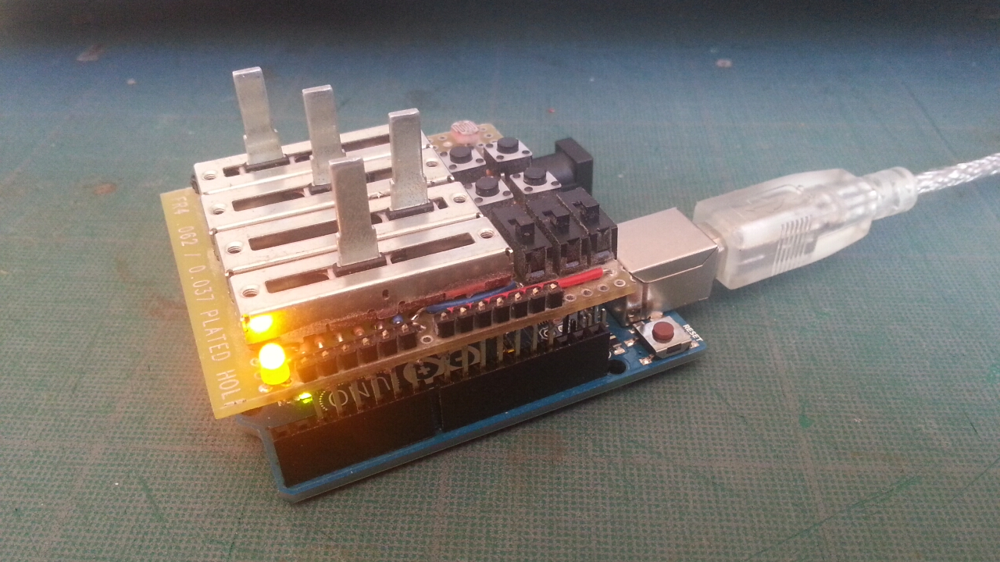
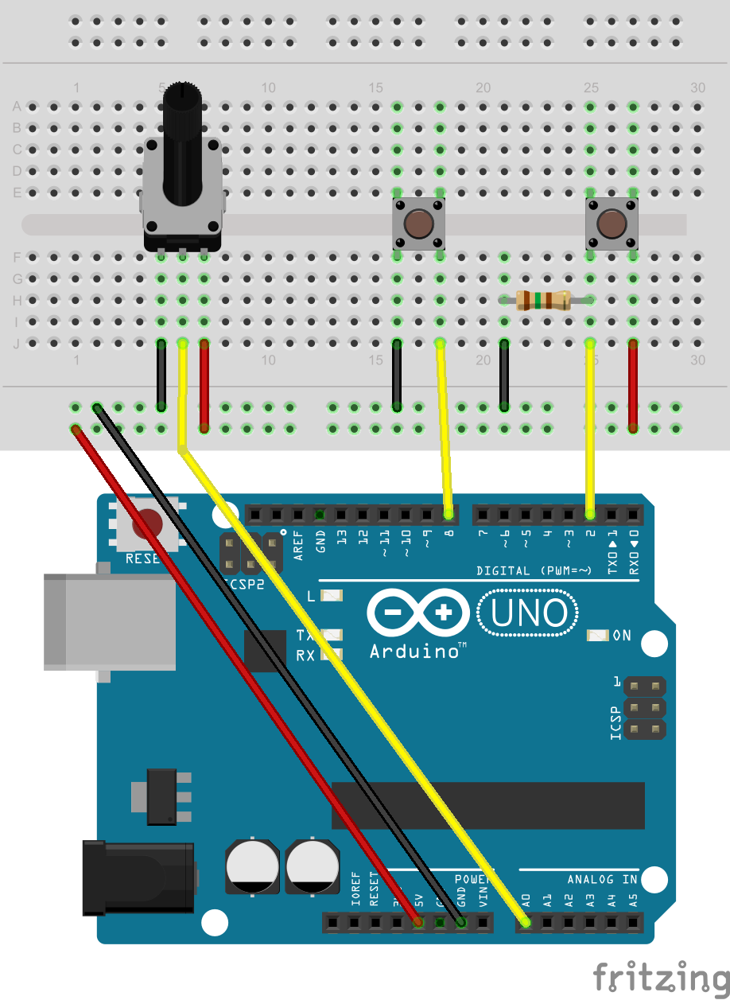

# SensorShieldLib  
Easilly attach and communicate sensors value in JSON.  
___


___
### Example:



```arduino
#include <sensorShieldLib.h>

SensorShield board;

void setup(){
	board.init(); // initialises and starts Serial

	board.addSensor( "btn1", 2 );
	board.addSensor( "btn2", 8, INPUT_PULLUP );
	board.addSensor( "pot1", A0 );
}

void loop(){
	board.update();
}
```
On `board.update();`, the lib checks sensors values and if any changed from previous `loop`, outputs JSON on Serial 9600 bds: `{"btn1":1,"btn2":0,"pot1":768}`

___
### Features
- A SensorShield class:
```arduino
SensorShield board;
```
- Simple initialisation:
```arduino
board.init();
```
- Support initialisation with different Stream:
```arduino
Serial.begin( 115200 );
board.init( Serial );
```
- Set your digital/analog pins ranges ( lib is configured by default for UNO ):
```arduino
board.setDigitalPinsRange( 2, 53 );
board.setAnalogPinsRange( A0, A15 );
```
- Easy sensor attach with auto recognition for analog/digital read:
```arduino
board.addSensor( "btn1", 2 );
board.addSensor( "pot1", A0 );
```
- Support INPUT\_PULLUP pinMode for digital sensors:
```arduino
board.addSensor( "btn2", 8, INPUT_PULLUP );
```
- Use an int or float function as a sensor:
```arduino
int secondsPassed(){
	return millis()/1000 ;
}
//...
board.addSensor("seconds", secondsPassed);
```
- Link a function with a sensor to compute its value instead of only reading its pin:
```arduino
float multBy2( int value ){
	return value * 2;
}
//...
board.addSensor( "pot1", A0 );
board.setSensorProcess( "pot1", multBy2 );
```
- Set minimun change needed on sensor value before updating its value and sending JSON:
```arduino
board.setSensorSensitivity( "pot1", 10 );
```
- Send JSON on each loop by setting sensitivity to 0:
```arduino
board.setSensorSensitivity( 0 );
```
- Set limit values of interest for a particular sensor:
```arduino
board.setSensorLimits( "pot1", 150, 850 );
```
- Possibility to add a visual signal when sending JSON with a led ...:
```arduino
board.emitLightOnChange( 13 );
```
- ... And to turn it on/off if desired:
```arduino
board.emitLightOnChange( false );
```
- Reads all digital/analog sensors on update and automatically send JSON on changes:
```arduino
void loop(){
	board.update();
}
```
- Public access to boolean hasNewValue:
```arduino
if( board.hasNewValue == true ) { ...... }
```
- Public access to String JSONMessage:
```arduino
String s = board.JSONMessage;
```
