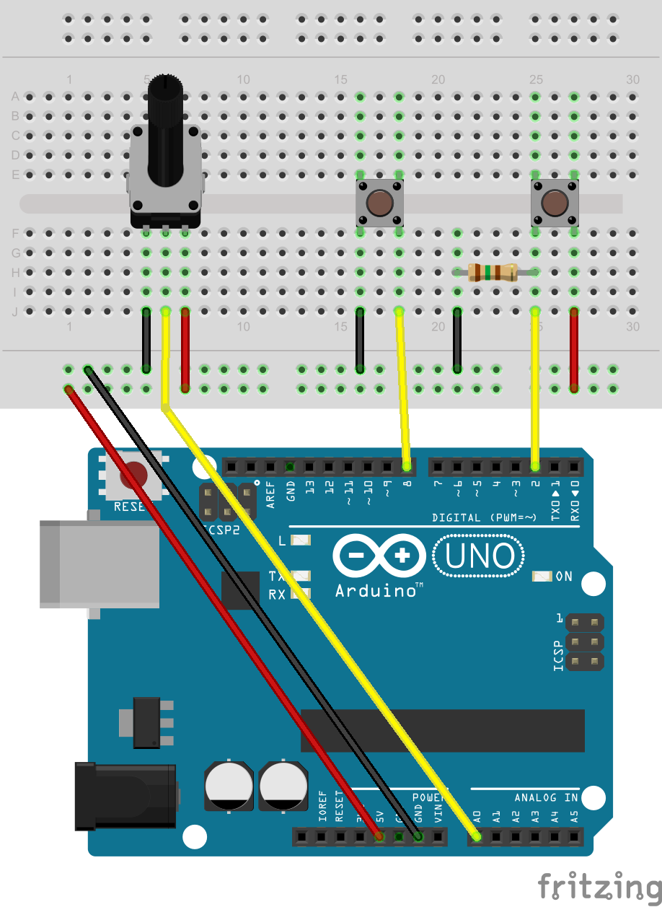

#SensorShieldLib  
A simple library for your custom sensorShields
___


This lib tends to communicate sensors values from your board in JSON format.  
___
###Features
- easy sensor attach (support INPUT_PULLUP)
- set your digital/analog pins ranges ( lib is configured by default for UNO )
- set analog sensitivity ie minimun change on analog captor for sending JSON 
- automatically reads all digital/analog sensors on update
- send JSON on changes  
___  
###Example:   
// example will be added to repo soon



```
#include <sensorShieldLib.h>

SensorShield board;

void setup()
{
	board.initialize();
	
	//board.setDigitalPinsRange( 2, 12 );
	//board.setAnalogPinsRange( A0, A5 );
 
	//board.setAnalogSensitivity(2);
 	
	board.addSensor( "btn1", 2 );

	board.addSensor( "btn2", 8, INPUT_PULLUP );

	board.addSensor( "pot1", A0 );
}

void loop()
{
	board.update();
}
```

Serial will print JSON like `{"btn1":1,"btn2":0,"pot1":768}`

___
###Coming soon
- Need integration for Stream selection `#include "HardwareSerial.h"`
- Suggestions welcome